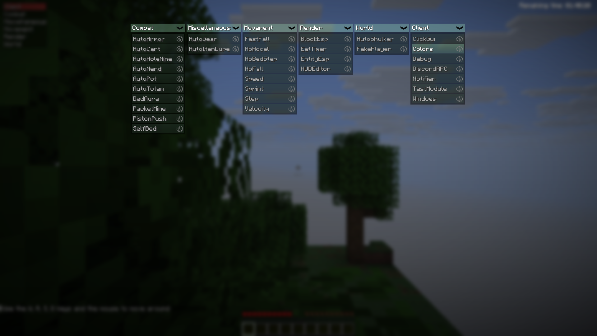
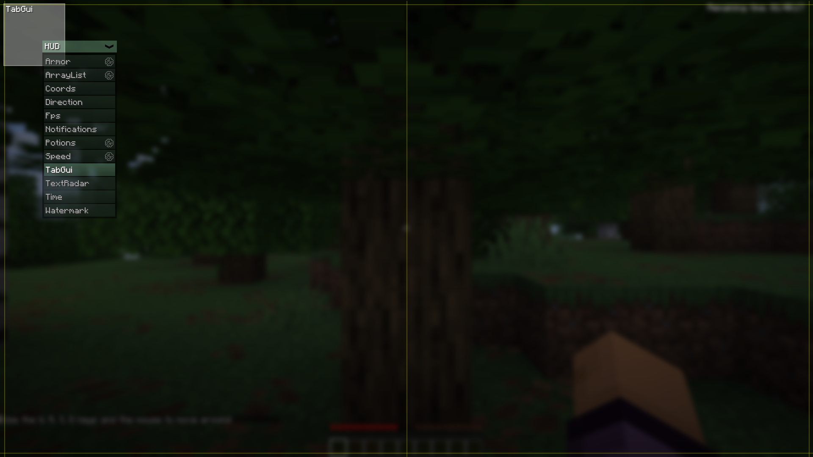
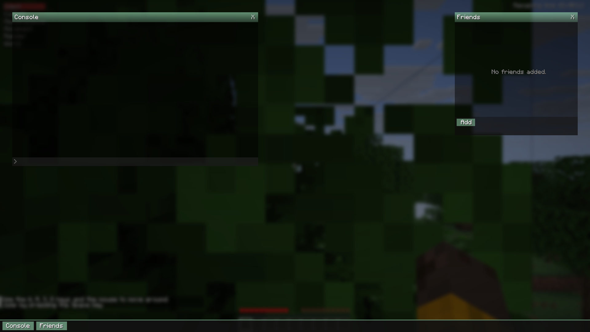

# Exeter

Exeter client. A client created by Friendly, for Minecraft version 1.8. It was released or
leaked on that version, and the original source code has since been reconstructed from it.
This repository ports it to modern Minecraft on Fabric, with cleanup of the decompiled code
along the way.

Exeter is most widely known as the client the 0x22 based Future client off of. To this day,
Future is still based on Exeter's base (0x22 has even admitted this). The event system works
the same way that 3arthqu4ke's does (and Future's does).

## Screenshots





## Current target

- Minecraft `26.4-snapshot-2`
- Fabric Loader `0.19.5`, Fabric API `0.161.2+26.4`
- Fabric Loom `1.18.2`
- JDK 25 (Eclipse Temurin)

## Requirements

- JDK 25. Set `JAVA_HOME` to a Temurin 25 install, e.g.
  `JAVA_HOME="C:\Program Files\Eclipse Adoptium\jdk-25.0.3.9-hotspot"`.
- The Gradle wrapper in the repo (`./gradlew`). No separate Gradle install needed.

## Building and running

```sh
./gradlew build        # compile + package the mod jar
./gradlew runClient    # launch the dev client
./gradlew format       # format all sources with google-java-format
./gradlew formatCheck  # fail if any source is unformatted (runs in CI on PRs)
```

## Controls

- `RSHIFT` — ClickGUI (module configuration)
- `` ` `` (grave) — Windows (console, friends)
- `,` (comma) — HUDEditor (reposition overlay elements)

## Features

- **Combat**: AutoArmor, AutoMend, AutoPot, AutoTotem, AutoCart, BedAura, PistonPush, SelfBed
- **Movement**: Speed, Sprint, Step, NoFall, NoAccel, Velocity, FastFall, NoBedStep
- **Render**: ClickGUI, HUDEditor, HUD modules (watermark, array list, armor, potions,
  coords, time, direction, text radar, notifications), BlockESP, EntityESP, EatTimer, TabGUI
- **World**: FakePlayer (spawnable test dummy with totem/gapple simulation), AutoShulker
- **Client**: Notifier, Windows system, Debug per-module logging, DiscordRPC
- **Misc**: AutoGear, AutoItemDupe
- TOML config per module under `config/exeter/`
- Headless client smoke test in CI (boots the game, joins a demo world, opens ClickGUI,
  HUDEditor and Windows, captures screenshots)

## Project layout

- `src/main/java/me/friendly/exeter/` — client source (`module/`, `config/`, `window/`,
  `logging/`, `util/`, `mixin/`, `test/`)
- `src/main/java/me/friendly/api/` — event system and helpers
- `.github/workflows/` — dev/release builds, format check, smoke test
- `run/` — local dev client directory (not committed)

## Credits

- Friendly — original 1.8 client
- Gopro336 — source reconstruction, cleanup, javadoc, and porting work
- OrangeMan432 — this fork
- Earthhack (3arthqu4ke) — FakePlayer implementation
- Lemon — various modules throughout the codebase
- Homovore (leonetics) — PistonCrystal module design and silent rotation
- OpenMyau (60124808866) — account manager this client's Accounts window is ported from
- Meteor Client — FreeLook camera concept
- Phobos (3arthqu4ke) — LINE compass design the CompassHud is based on, rolling rainbow gradient
- notanorange-main — improved ClickGUI fuzzy finder
